# Laboratório — Análise de Pacotes com Wireshark 🦈

## 📌 Objetivo

Este laboratório tem como objetivo analisar um arquivo de captura de pacotes (`.pcap`) utilizando o Wireshark, a fim de compreender como ocorre a comunicação em uma rede e como identificar informações relevantes para investigações em cibersegurança.

---

## 🧠 Cenário

Neste laboratório, você assume o papel de um **analista de segurança** responsável por investigar o tráfego de rede gerado por um usuário ao acessar um site.

A análise envolve:

- identificação de IPs de origem e destino  
- análise de protocolos de rede  
- inspeção de pacotes  
- aplicação de filtros para investigação  

---

## 🛠️ Ferramentas utilizadas

- Wireshark  
- Máquina virtual Windows (Qwiklabs / Cloud Skills Boost)  

---

## 🚀 Etapa 1 — Iniciar o laboratório

1. Acesse o laboratório pelo Coursera  
2. Clique em **Launch App**  
3. Clique em **Start Lab**  
4. Clique em **Open Windows VM**  

Isso abrirá uma máquina virtual com sistema Windows.

📸

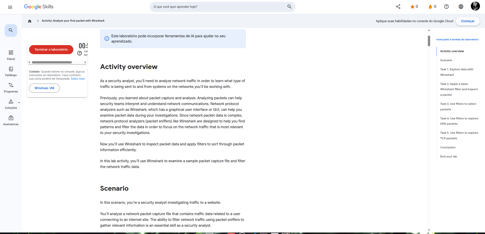

---

## 💻 Etapa 2 — Acessar a máquina virtual

Após abrir a VM:

- aguarde o carregamento do sistema  
- permita acesso à área de transferência (clipboard)  

📸  

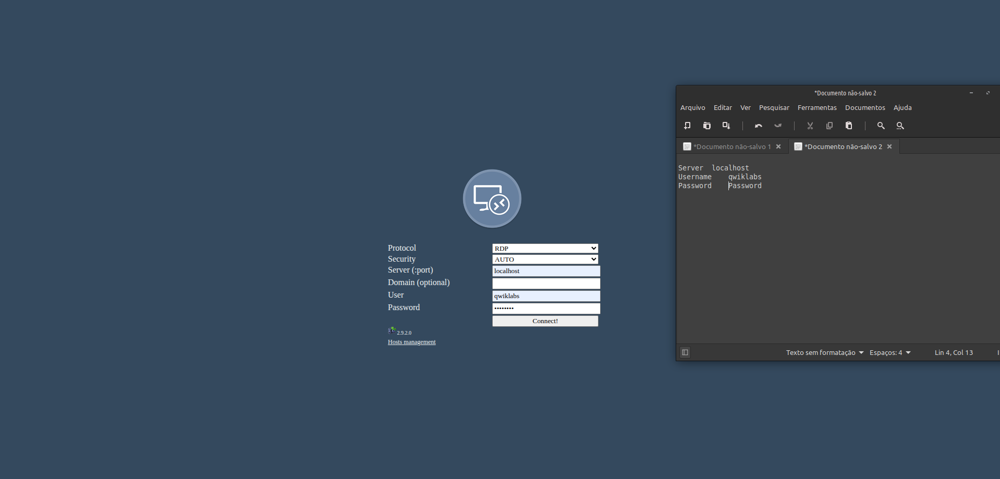

---

## 🔍 Etapa 3 — Abrir o arquivo de captura

1. Localize o arquivo `sample pcap` na área de trabalho  
2. Dê **duplo clique** para abrir no Wireshark  

📸


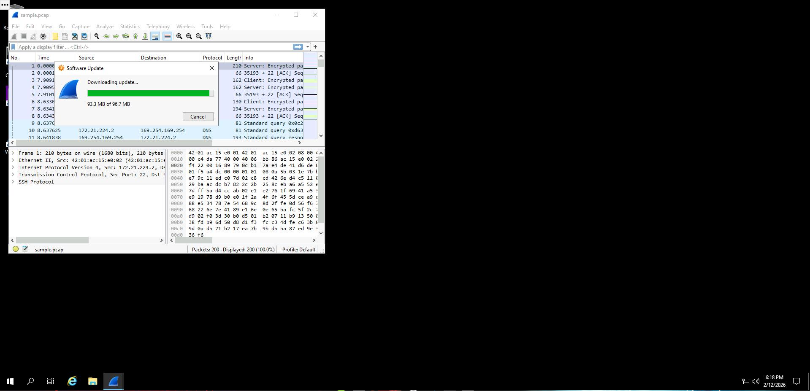

---

## 🦈 Etapa 4 — Explorar o Wireshark

Ao abrir o arquivo, o Wireshark exibirá:

- lista de pacotes (parte superior)  
- detalhes do pacote (meio)  
- dados em formato hexadecimal (inferior)  

📸

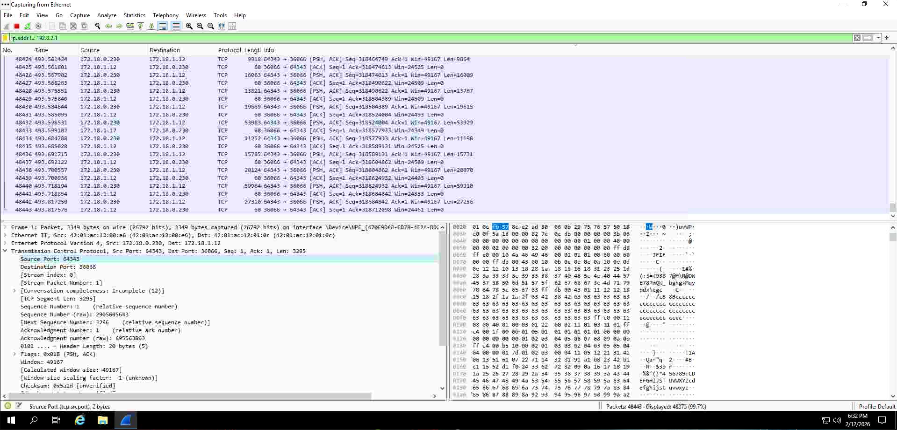

---

## 📦 Etapa 5 — Analisar um pacote

Selecione um pacote para visualizar seus detalhes.

```tex
ip.addr == 142.250.1.139
```

Observe:

- IP de origem  
- IP de destino  
- protocolo (TCP, UDP, DNS, etc.)  
- payload  

📸

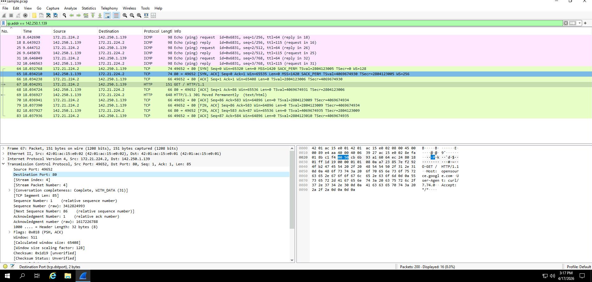

---

## 🌐 Etapa 6 — Identificar IPs

Utilize os dados do pacote para identificar:

- endereço IP de origem  

```text
ip.src == 142.250.1.139
```

- endereço IP de destino  

```text
ip.dst == 142.250.1.139
```

📸

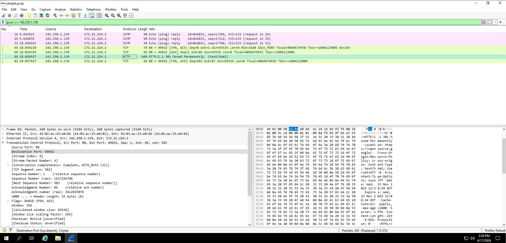

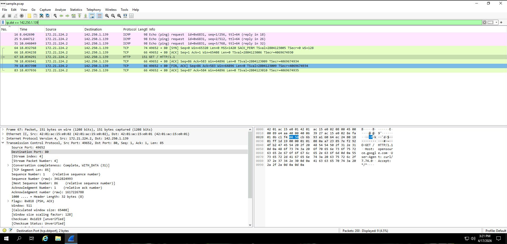

---

## 🔎 Etapa 7 — Filtrar tráfego por protocolo

No campo de filtro do Wireshark, utilize:

```text
eth.addr == 42:01:ac:15:e0:02
```

Isso exibirá apenas pacotes DNS.

📸

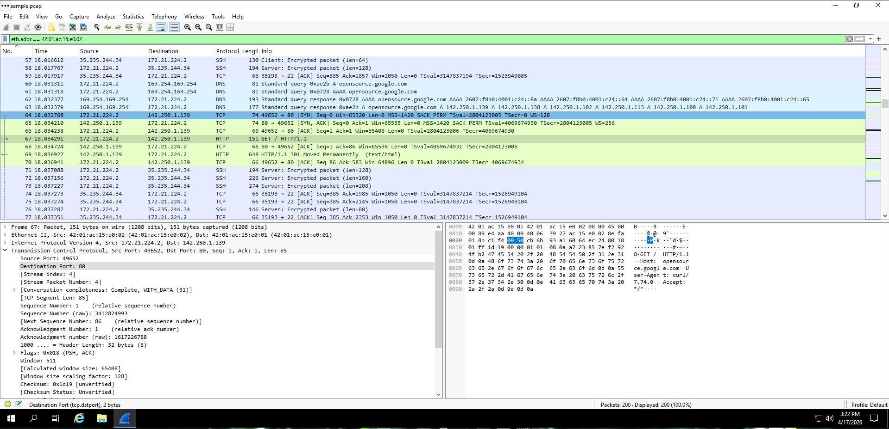

---

## 🔁 Etapa 8 — Filtrar por IP

```text
ip.addr == 142.250.1.139
```

📸

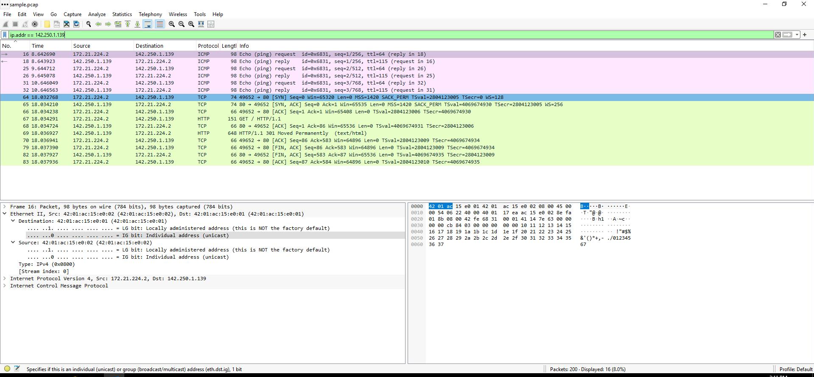

---

## 📡 Etapa 9 — Filtrar tráfego UDP (DNS)

```text
udp.port == 53
```

Isso mostra apenas tráfego DNS via UDP.

📸

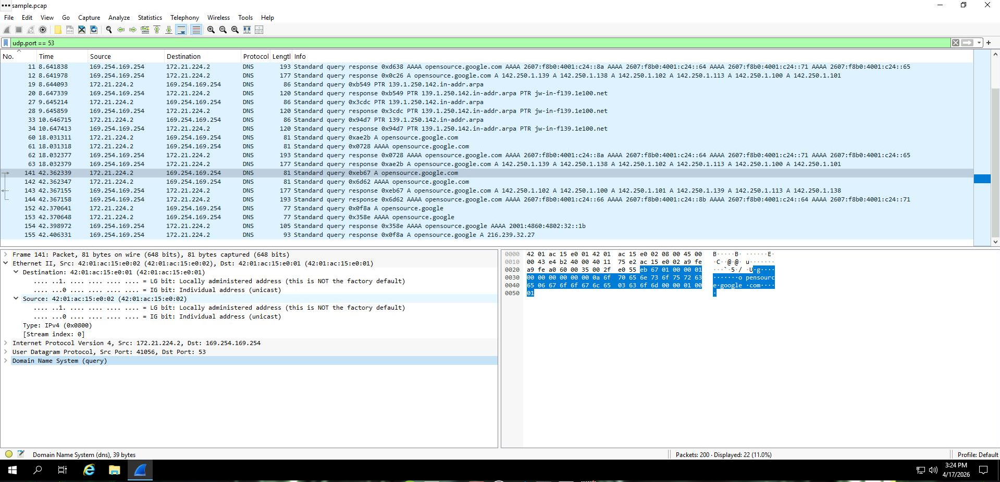

---

## 🔐 Etapa 10 — Filtrar tráfego TCP

```text
tcp.port == 80
```

Exibe pacotes TCP.

📸 Inserir print TCP

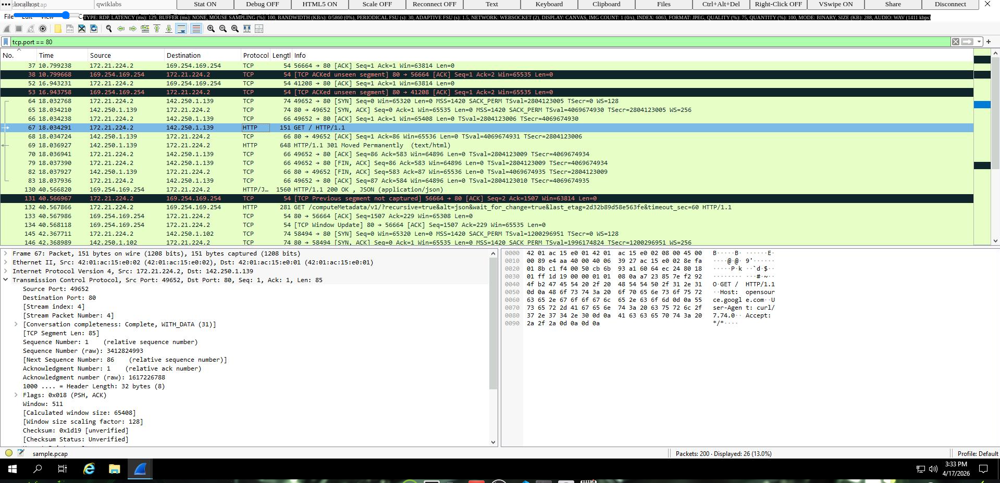

---

## 🔍 Etapa 11 — Buscar conteúdo no pacote (Busca Avançado)

```text
tcp contains "curl"
```

Permite encontrar palavras dentro do tráfego.

📸

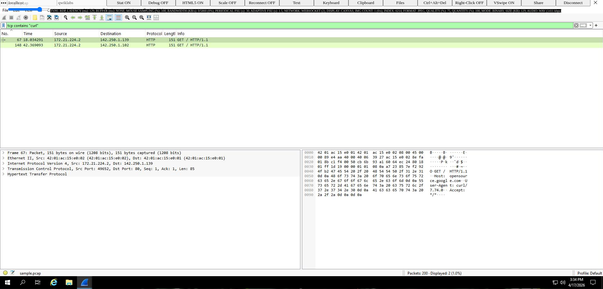

---

## 📊 Etapa 12 — Analisar protocolos

Durante a análise, observe:

DNS → resolução de nomes
TCP → conexão
HTTP/HTTPS → comunicação web

📸


---

### ✅ Conclusão

Este laboratório permitiu:

compreender a estrutura de pacotes
analisar tráfego de rede na prática
utilizar filtros no Wireshark
identificar padrões de comunicação

A análise de pacotes é uma habilidade essencial para profissionais de cibersegurança, especialmente em atividades de monitoramento e resposta a incidentes.
