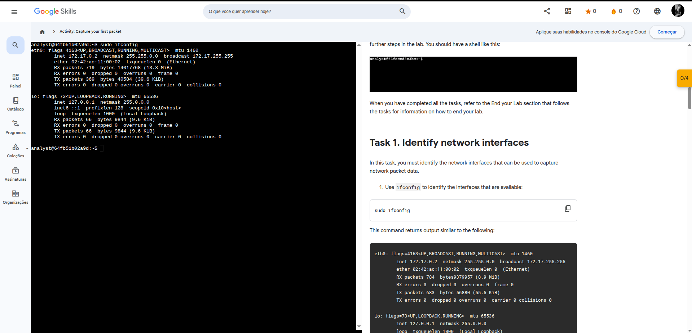
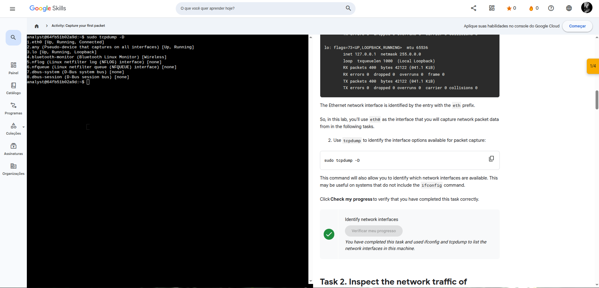
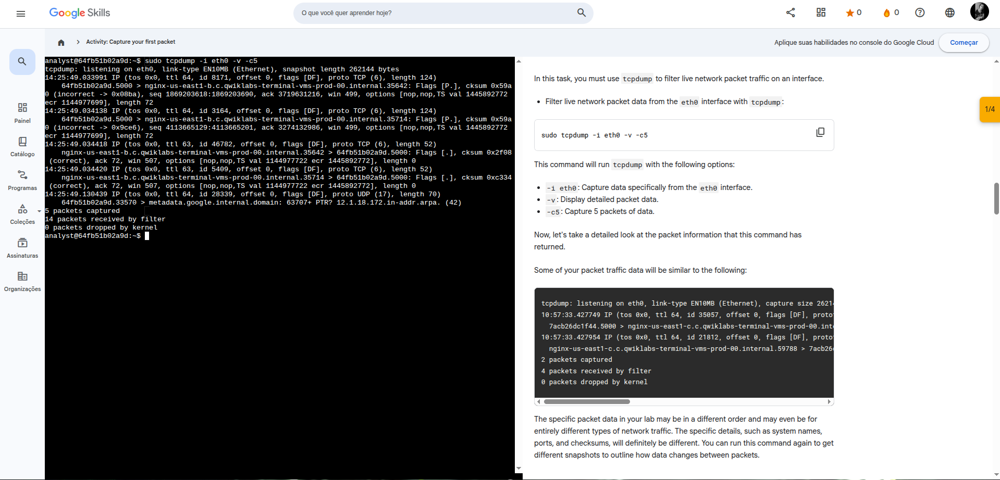
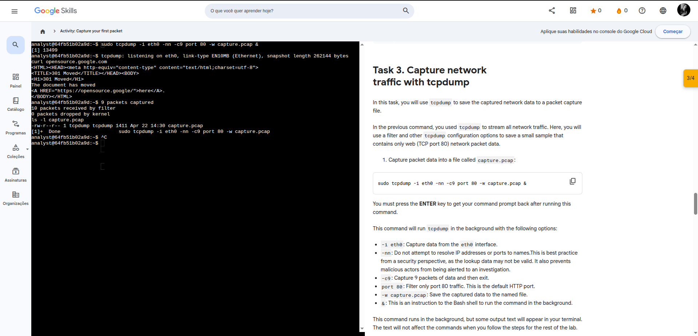
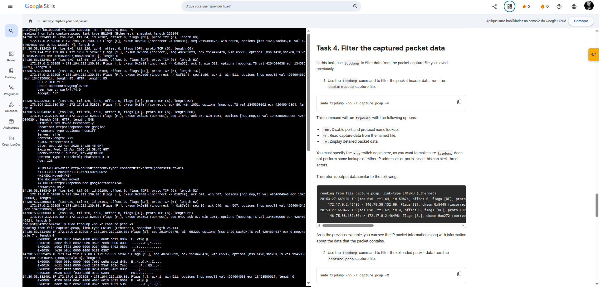

# 🧪 Capture de Pacotes com tcpdump (Linux)


## 📌 Descrição

Este projeto demonstra, na prática, a captura e análise de tráfego de rede utilizando o **tcpdump** em ambiente Linux.

A atividade simula o trabalho de um analista de segurança ao inspecionar pacotes de rede, filtrar tráfego específico e analisar dados capturados em arquivos `.pcap`.

---

## 🎯 Objetivos de Aprendizado

* Identificar interfaces de rede disponíveis
* Capturar tráfego de rede em tempo real
* Filtrar pacotes por protocolo e porta
* Salvar capturas em arquivos `.pcap`
* Analisar pacotes capturados (modo detalhado e hexadecimal)

---

## 🖥️ Ambiente Utilizado

* Sistema Linux (terminal Bash)
* Ferramenta: `tcpdump`
* Interface de rede: `eth0`

---

## ⚙️ Etapas Realizadas

### 🔹 1. Identificação das interfaces de rede

```bash
sudo ifconfig
```



```bash
sudo tcpdump -D
```



* Identificação da interface `eth0` como principal para captura de pacotes.

---

### 🔹 2. Captura de tráfego em tempo real

```bash
sudo tcpdump -i eth0 -v -c5
```



* Captura de 5 pacotes com informações detalhadas.
* Análise de:

  * IP de origem e destino
  * Portas
  * Flags TCP
  * Tamanho dos pacotes

---

### 🔹 3. Captura de tráfego HTTP em arquivo

```bash
sudo tcpdump -i eth0 -nn -c9 port 80 -w capture.pcap &
```



```bash
curl opensource.google.com
```

* Captura de tráfego HTTP (porta 80)
* Geração de tráfego com `curl`
* Armazenamento dos dados em `capture.pcap`

Verificação:

```bash
ls -l capture.pcap
```

---

### 🔹 4. Análise dos pacotes capturados

#### Modo detalhado

```bash
sudo tcpdump -nn -r capture.pcap -v
```



#### Modo hexadecimal + ASCII

```bash
sudo tcpdump -nn -r capture.pcap -X
```

* Permite identificar padrões, headers e conteúdo dos pacotes
* Útil para análise forense e investigação de incidentes

---

## 📊 Resultados Observados

* Captura bem-sucedida de pacotes HTTP
* Identificação de requisições e respostas (ex: HTTP 301 Moved)
* Visualização de dados em formato legível e hexadecimal
* Nenhuma perda de pacotes durante a captura

---

## 🧠 Conclusão

Este laboratório proporcionou experiência prática com captura e análise de tráfego de rede, reforçando conceitos fundamentais de redes e segurança da informação.

O uso do `tcpdump` demonstrou ser essencial para:

* Monitoramento de rede
* Investigação de incidentes
* Análise de comportamento de aplicações

---

## 📌 Observação

Este projeto foi desenvolvido como parte de um laboratório prático de análise de rede.
Todos os testes foram realizados em ambiente controlado.
