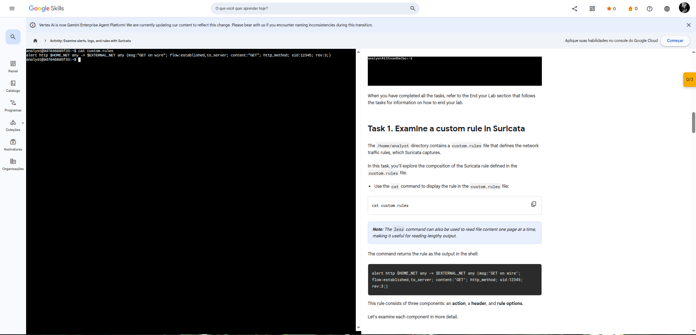
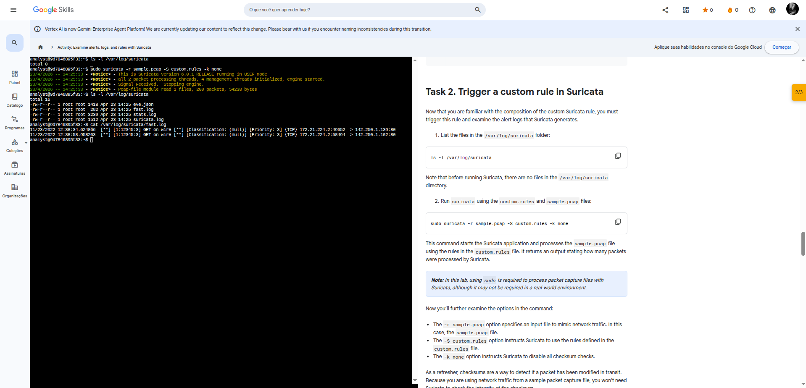
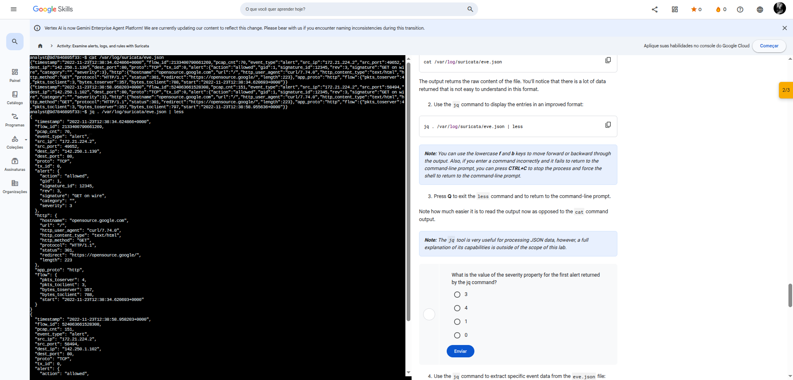

# Lab 01 — Explorar Assinaturas e Registros com o Suricata

**Módulo:** 02 — Monitoramento de Segurança com IDS  
**Plataforma:** Qwiklabs / Google Skills  

---

## 🎯 Objetivo

Praticar o uso do Suricata para:

- Examinar uma regra personalizada
- Acionar uma regra e analisar logs de alerta
- Examinar as saídas do `eve.json`

---

## 📁 Arquivos do laboratório

| Arquivo | Descrição |
|---------|-----------|
| `sample.pcap` | Captura de pacotes para simular tráfego de rede |
| `custom.rules` | Arquivo com as regras personalizadas do Suricata |
| `fast.log` | Gerado após execução — alertas básicos |
| `eve.json` | Gerado após execução — log completo em JSON |

---

## ✅ Task 1 — Examinar uma regra personalizada no Suricata

```bash
cat custom.rules
```

**Saída:**

```
alert http $HOME_NET any -> $EXTERNAL_NET any (msg:"GET on wire"; flow:established,to_server; content:"GET"; http_method; sid:12345; rev:3;)
```

**Anatomia da regra:**

| Componente | Valor | Significado |
|------------|-------|-------------|
| Ação | `alert` | Gera alerta quando a regra for ativada |
| Protocolo | `http` | Aplica-se apenas a tráfego HTTP |
| Origem | `$HOME_NET any` | Qualquer porta da rede interna |
| Destino | `$EXTERNAL_NET any` | Qualquer porta da rede externa |
| `msg` | `"GET on wire"` | Texto do alerta |
| `flow` | `established,to_server` | Pacotes do cliente para o servidor |
| `content` | `"GET"` | Busca o método GET no pacote HTTP |
| `sid` | `12345` | ID único da assinatura |
| `rev` | `3` | Versão 3 da regra |

> 💡 Essa regra aciona um alerta toda vez que o Suricata detecta o método `GET` em um pacote HTTP saindo da rede interna para a externa.

**Print — Task 1:**



---

## ✅ Task 2 — Acionar uma regra personalizada no Suricata

**1. Verificar diretório de logs (antes de executar):**

```bash
ls -l /var/log/suricata
```

> Resultado: diretório vazio antes da execução.

**2. Executar o Suricata com a regra e o arquivo pcap:**

```bash
sudo suricata -r sample.pcap -S custom.rules -k none
```

| Flag | Função |
|------|--------|
| `-r sample.pcap` | Define o arquivo de entrada simulando tráfego |
| `-S custom.rules` | Usa as regras do arquivo `custom.rules` |
| `-k none` | Desativa verificações de checksum |

**3. Verificar diretório de logs (após execução):**

```bash
ls -l /var/log/suricata
```

> Resultado: 4 arquivos gerados — `eve.json`, `fast.log`, `stats.log`, `suricata.log`

**4. Visualizar alertas no fast.log:**

```bash
cat /var/log/suricata/fast.log
```

**Saída:**

```
11/23/2022-12:38:34.624866  [**] [1:12345:3] GET on wire [**] [Classification: (null)] [Priority: 3] {TCP} 172.21.224.2:49652 -> 142.250.1.139:80
11/23/2022-12:38:58.958203  [**] [1:12345:3] GET on wire [**] [Classification: (null)] [Priority: 3] {TCP} 172.21.224.2:58494 -> 142.250.1.139:80
```

> Cada linha = um alerta gerado. Contém: timestamp, mensagem da regra, IPs e portas de origem/destino.

**Print — Task 2:**



---

## ✅ Task 3 — Examinar a saída do eve.json

**1. Ver conteúdo bruto:**

```bash
cat /var/log/suricata/eve.json
```

> Saída densa e difícil de ler no formato bruto.

**2. Formatar com jq:**

```bash
jq . /var/log/suricata/eve.json | less
```

> Use `f` e `b` para navegar | `Q` para sair

**3. Extrair campos específicos:**

```bash
jq -c "[.timestamp,.flow_id,.alert.signature,.proto,.dest_ip]" /var/log/suricata/eve.json
```

**Saída:**

```
["2022-11-23T12:38:34.624866+0000",14500150016149,"GET on wire","TCP","142.250.1.139"]
["2022-11-23T12:38:58.958203+0000",1647223379236084,"GET on wire","TCP","142.250.1.102"]
```

**4. Filtrar por flow_id específico:**

```bash
jq "select(.flow_id==XXXXXXXXXXXXXXXXXXX)" /var/log/suricata/eve.json
```

> Substitua `X` por um `flow_id` retornado no comando anterior.

**Print — Task 3:**



---

## ❓ Respostas das perguntas do lab

| Pergunta | Resposta |
|----------|----------|
| Valor da propriedade `severity` do primeiro alerta? | `3` |
| IP de destino do último evento no `eve.json`? | `142.250.1.102` |
| Assinatura do alerta da primeira entrada? | `GET on wire` |

---

## 📝 Conclusão

Após completar o lab, você foi capaz de:

- ✅ Criar e examinar regras personalizadas no Suricata
- ✅ Executar o Suricata contra um arquivo `.pcap`
- ✅ Analisar alertas no `fast.log`
- ✅ Explorar o `eve.json` com o utilitário `jq`
- ✅ Correlacionar eventos usando o campo `flow_id`
