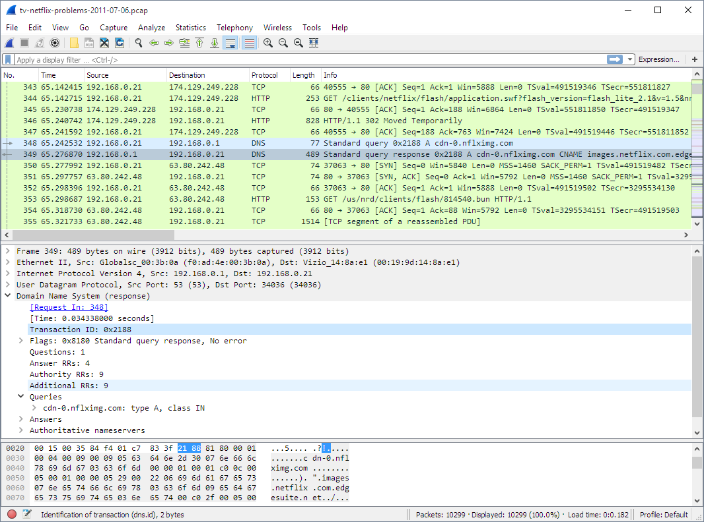
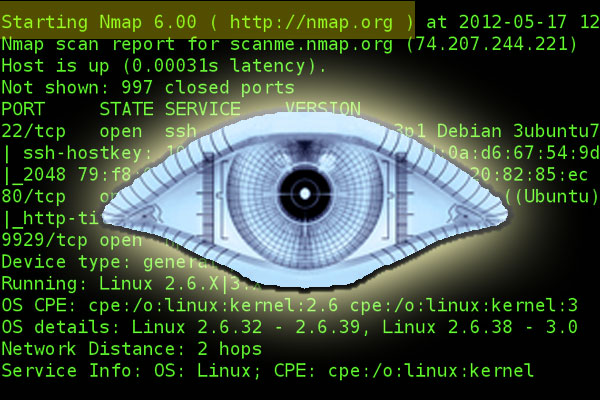
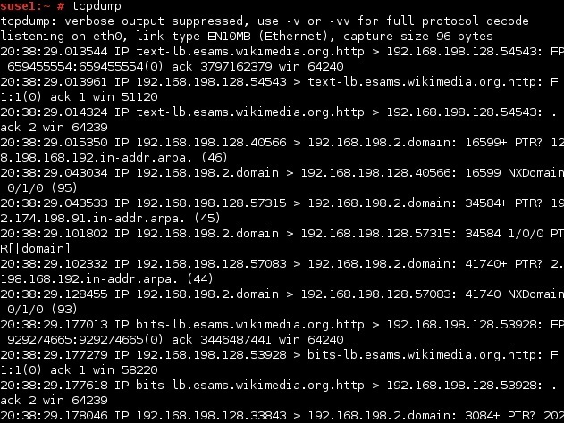
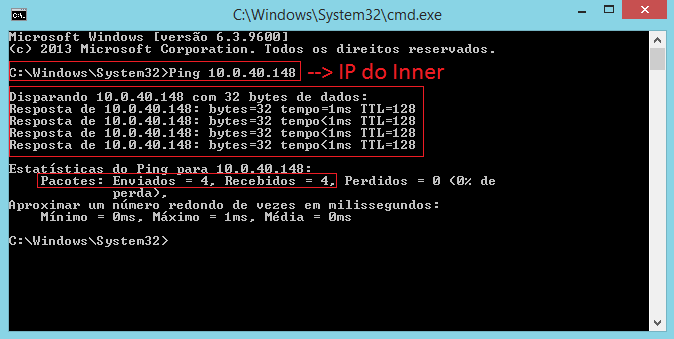
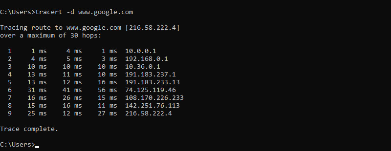

# 🔧 Ferramentas de Rede

As ferramentas de rede são essenciais para qualquer profissional de **Cibersegurança**.  
Elas permitem **monitorar, analisar, proteger e solucionar problemas** em redes de computadores.

---

## 📡 Wireshark



O **Wireshark** é um analisador de protocolos de rede (sniffer).  
Ele captura todo o tráfego que passa pela interface de rede e exibe os pacotes em tempo real.

### 🎯 Uso em Segurança

- Detectar tráfego suspeito ou não autorizado  
- Analisar ataques como *Man-in-the-Middle*  
- Verificar envio de dados sem criptografia  
- Investigar incidentes de segurança  

### ⚙️ Como funciona

Coloca a placa de rede em **modo promíscuo**, capturando todos os pacotes que circulam na rede, não apenas os destinados ao seu dispositivo.

---

### 🗺️ Nmap (Network Mapper)



O **Nmap** é uma ferramenta de varredura de rede utilizada para identificar:

- Dispositivos ativos  
- Portas abertas  
- Serviços em execução  

### 🎯Uso em Segurança

- Descobrir dispositivos desconhecidos  
- Identificar portas vulneráveis  
- Detectar serviços desnecessários  
- Realizar inventário de rede  

### 💻 Exemplo de uso

```bash
nmap 192.168.1.1
```

### 💻 tcpdump

 

O tcpdump é uma ferramenta de captura de pacotes via linha de comando, muito utilizada em servidores Linux.

### 🎯Uso em Segurança

- Capturar pacotes em servidores remotos

- Salvar tráfego para análise posterior

- Monitorar conexões em tempo real

### 💻 Exemplo

```bash
tcpdump -i eth0
```

Captura todo o tráfego da interface eth0

---

### 📶 Ping



Ferramenta simples que utiliza o protocolo ICMP para testar conectividade.

### 🎯 Para que serve

- Verificar se um host está online

- Medir latência

- Detectar perda de pacotes

### 💻Exemplo

```bash
ping google.com
```

⚠️ Em ambientes corporativos, o ICMP pode ser bloqueado por firewalls por motivos de segurança.

---

### 🛤️ Traceroute



O Traceroute mostra o caminho que os pacotes percorrem até o destino.

### 🎯Uso em Segurança

- Identificar falhas na rota

- Detectar redirecionamentos suspeitos

- Mapear infraestrutura de rede

### 💻Exemplo

```bash
traceroute google.com
```

---

### 📌 Conclusão

Ferramentas de rede são fundamentais para:

✔ Diagnóstico

✔ Monitoramento

✔ Resposta a incidentes

✔ Análise forense

✔ Testes de segurança

Dominar essas ferramentas é um passo essencial para atuar em Cibersegurança
